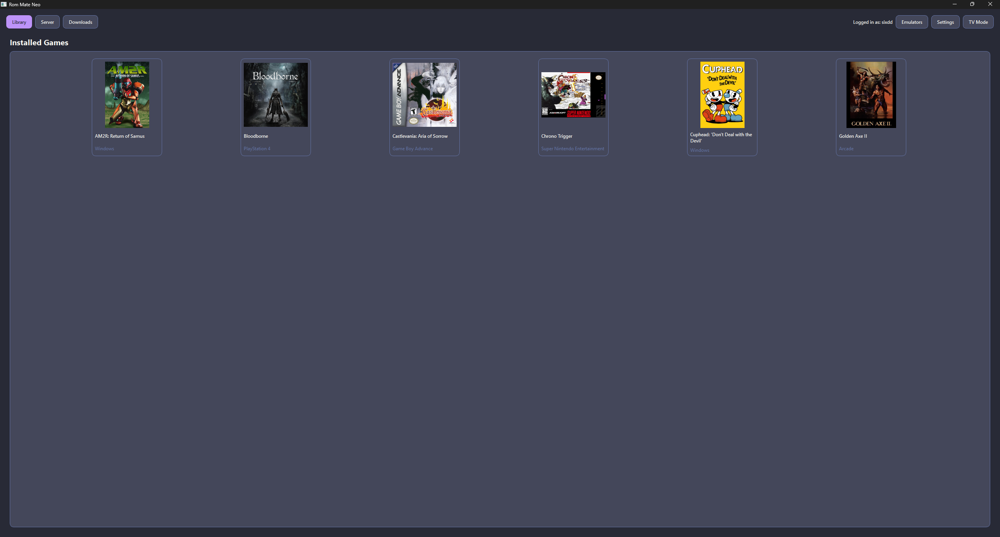
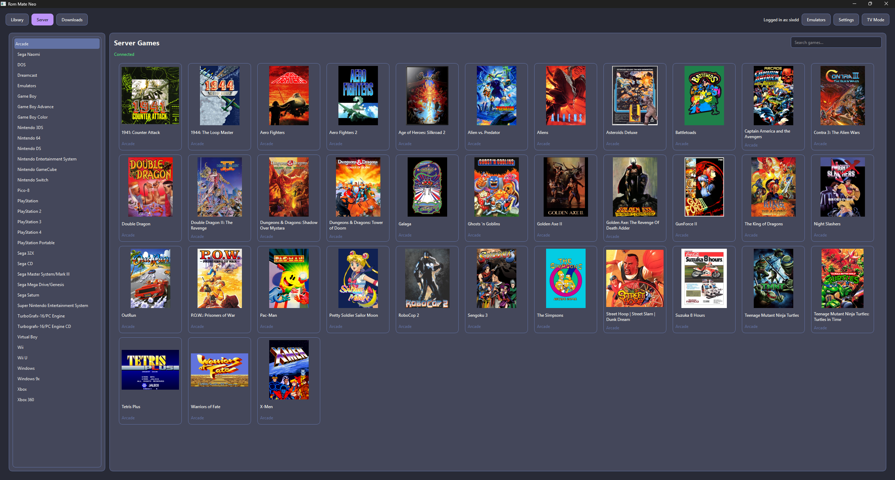
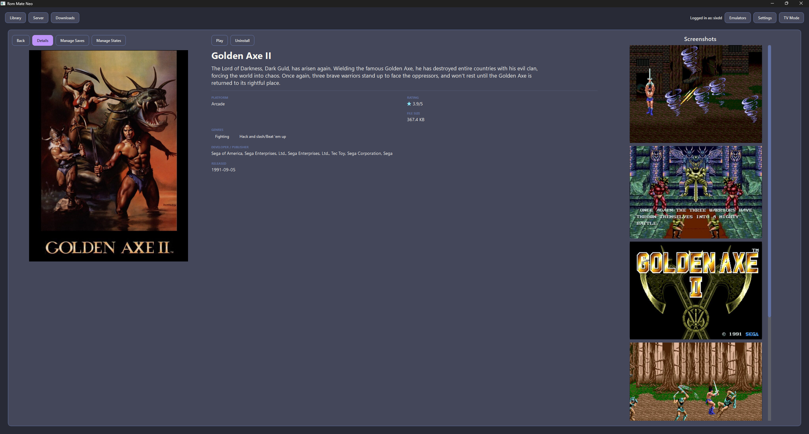
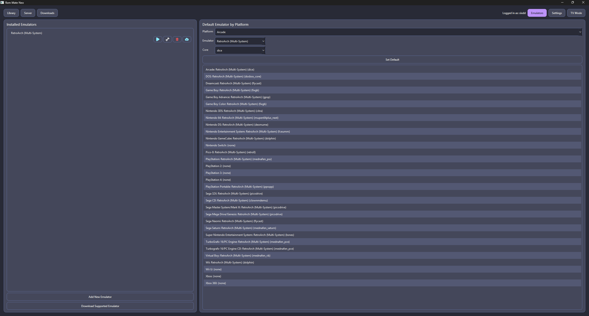
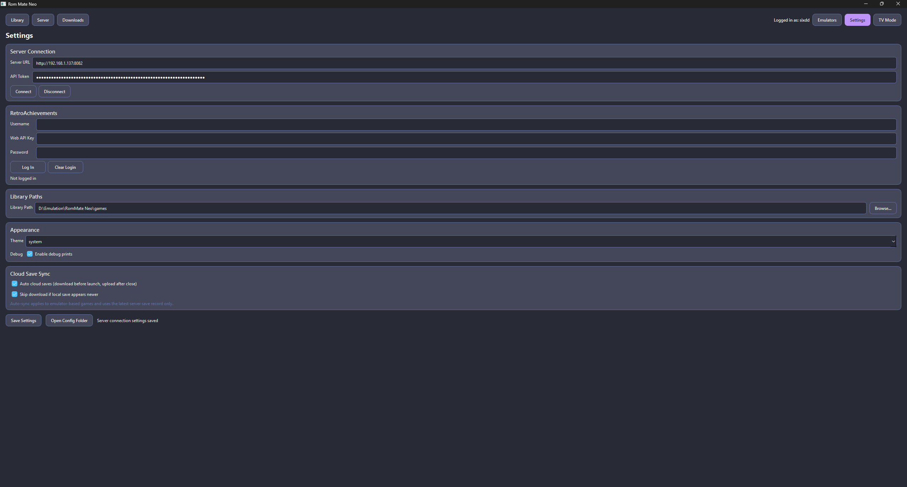
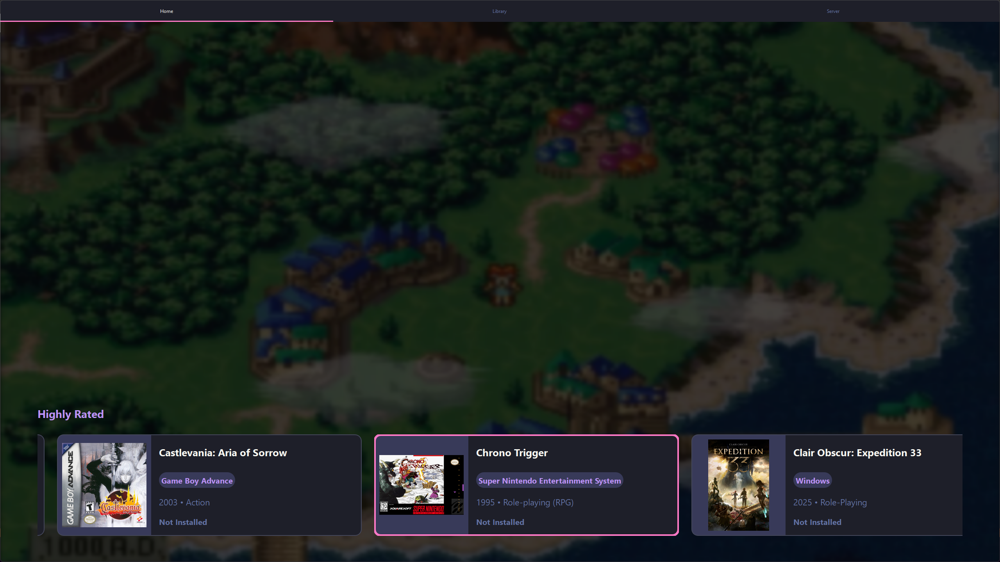
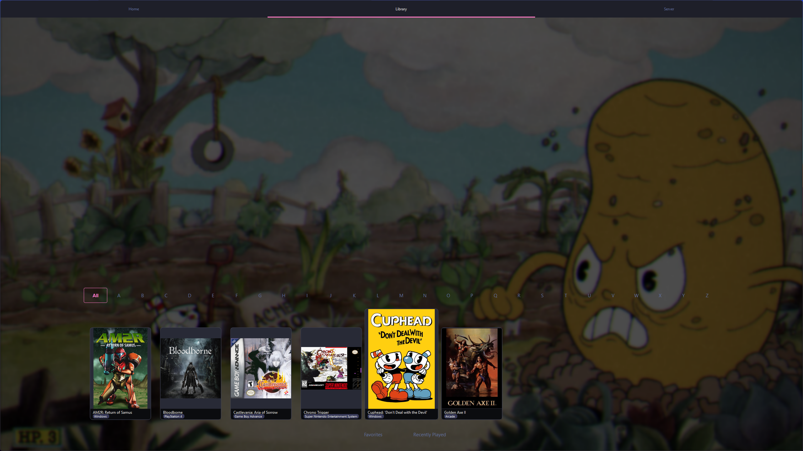
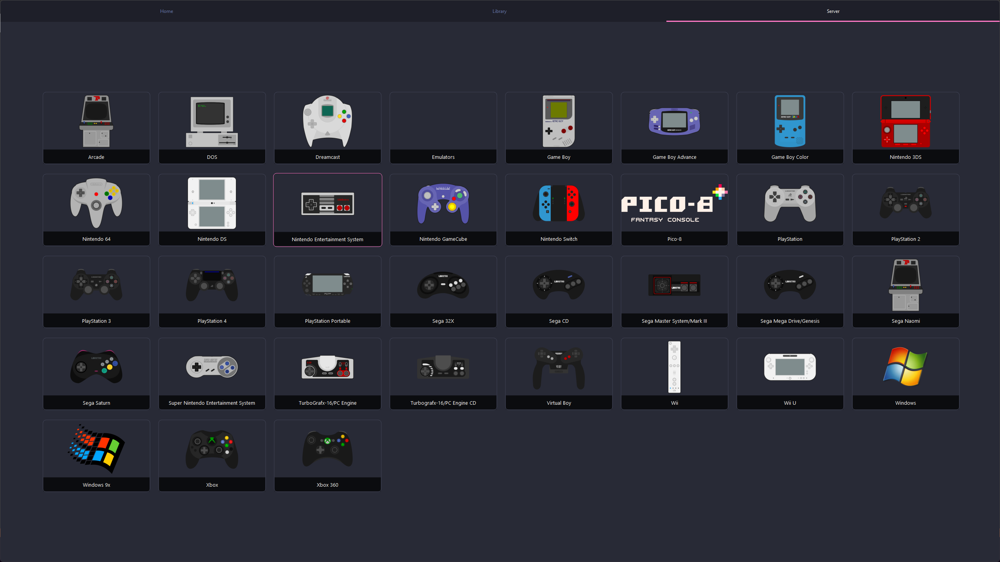
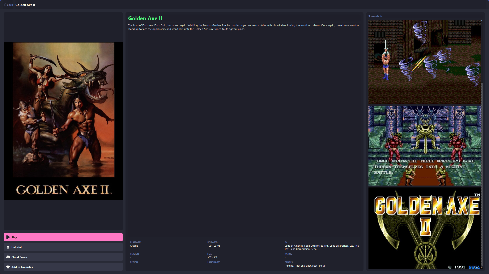

# GRID Launcher
Game Repository Interface & Downloader — A launcher for RomM.

Please be aware that this application is created using AI tools/coding, if this is a problem for you I invite you to make your own.

  

## Desktop Mode Screenshots

## TV Mode Screenshots

## Features

### Both Modes
- Library tab with cover art display for installed games
- Server tab with platform list and game grid for games on your server
- Cloud save support and in-app management
- Supports screen resolutions from 720p and up, good for small handhelds up to 4k monitor/tv

### Desktop Mode
- Settings tab with configuration options for server address and client token, retroachievements details, theme selection and cloud saves toggle
- Emulator tab for manual or automated install and setup of emulators from official sources
- Light/Dark Themes
- RetroAchievements integration and browsing

### TV Mode (Pending Rewrite)
- Home tab with several rows to help you discover your collection
    - Continue Playing: Auto-sorts your most recently played and installed games to quickly jump back in
    - Favorites: Shows any games marked as favorite for your account
    - New Additions: Sorts newly added games to the front of the row
    - Highly Rated: Displays highest rated games on your server based on an average of all available ratings data for your server
- Fullscreen Pause feature to quickly pause and resume games and quit out of any game/emulator that doesn't already include an in-app menu

> Fullscreen Pause may conflict with the Windows Game Bar or Steam Overlay, for best results disable both before using Fullscreen Pause or disable Fullscreen Pause from the TV Mode settings menu using <ESC/Guide>

## Emulator Setup

- Windows: Emulators can be installed manually or automatically on Windows builds with automated download and setup, firmware will be pulled from your server as well and placed in the default directory for the emulator.
- Linux: Emulators installed via flatpak currently require manual setup (auto-setup is wip). Auto-download and setup is supported for emulators that are distributed via AppImage or native binaries.

## Third-Party Software

This project bundles the following third-party software or assets:

- **7-Zip** — Copyright © 1999-2026 Igor Pavlov. Licensed under GNU LGPL. The unRAR code is licensed under a mixed license (GNU LGPL + unRAR restriction). See [assets/tools/7z/License.txt](assets/tools/7z/License.txt) for full license details. Source code: https://github.com/ip7z/7zip
- **RetroArch assets** — PNG image files in [assets/retroarch-assets](assets/retroarch-assets) sourced from the libretro/retroarch-assets repository. Licensed under Creative Commons Attribution 4.0 International (CC BY 4.0). Source: https://github.com/libretro/retroarch-assets
- **SVG Repo** — Icons by [SVG Repo](https://www.svgrepo.com/)
